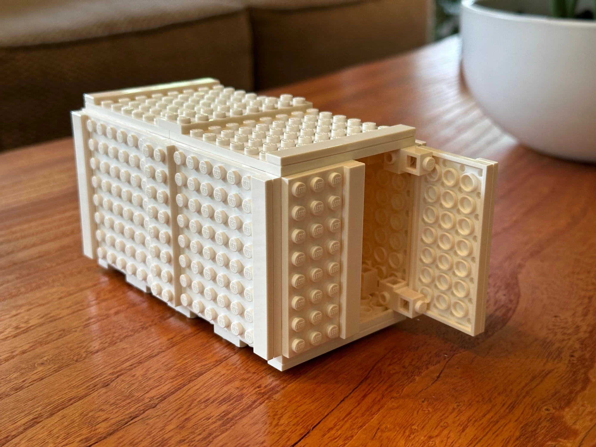

# Image and Asset Task List

Companion to [coverage.md](coverage.md). Coverage tracks whether the *text* stands alone; this file tracks the visual layer.

## Where the site stands

90 real images across 24 pages and roughly 150,000 words. The distribution is very uneven:

| Density | Pages |
|---|---|
| Good (1 image per 550–700 words) | b2.2 (11), b2.1 (15), a3.3 (13) |
| Moderate (1 per 1,200–1,700) | a1.1 (8), a3.2 (6), a3.1 (5), c3.1 (4), c4.1 (3), c2.1 (3) |
| Thin (1 per 1,900–3,700) | a3.4 (4), b1.1 (3), c1.3 (2), a2.1 (2), a2.2 (2), c1.2 (2), c1.1 (2), b3.1 (2), c2.2 (2), b3.2 (2) |
| Bare (1 or 0 images) | **b3.3 (0)**, **b3.4 (1)**, **a4.1 (1)**, **b4.1 (1)**, **c3.2 (1)** |

b3.4, a4.1 and b4.1 each carry a single image, and in two of those cases it is a promo card borrowed from another topic rather than teaching content. b3.3 has none at all.

Matching the b2.2 / a3.3 density across the site means roughly 220 images, so about 130 more than exist now. The lists below come to 212, so there is room to drop the P2s entirely and still land in range.

## How the lists are split

- **List A — Shoot or make yourself.** Nothing to research. Every item is a photo, drawing, rig or screen capture you can produce with what is around you. Grouped by shooting session rather than by page, because one afternoon covers several pages at once.
- **List B — Build together.** Charts, diagrams, timelines and SVG. These are the ones to sit down and make with me.
- **List C — Source externally.** Historical, industrial or inaccessible subjects. Each carries a likely source and its rights position so you are not starting from a blank search.

Priority marks: **P1** on the bare and thin pages, **P2** elsewhere. Items already requested in coverage.md are marked *(cov)*.

File convention, matching what is already in place: save as `TOPIC/name.webp` (keep a `.png`/`.jpg` original alongside), and mark it up as

```html
<figure class="case-photo">
  <a href="A3.2/shell.webp" target="_blank" rel="noopener"></a>
  <figcaption><em>Caption.</em></figcaption>
</figure>
```

---

## Start here: twelve highest-impact items

The ones that fix the worst starvation or teach something no amount of prose will.

1. **Lego Technic mechanism set** (A3, ten rigs, one session) — fills b3.3's zero and doubles a3.3. *(cov)*
2. **Same object drawn five ways**: freehand, isometric, orthographic, exploded, perspective, hand drawn, shot as a row — a2.2 and b2.2, the single best teaching image on the site.
3. **Breadboard and component set** for b3.4 — sensors, outputs, logic gates, multimeter in use. Takes b3.4 from 1 to about 12.
4. **Five manufacturing categories in action**, one photo each — a4.1 currently has no teaching image at all.
5. **Forming techniques diagram set** (List B) — a4.1.8 is the weakest sub-point in the whole review.
6. **Truss type catalogue** (List B) — b3.2.4, roughly 200 lines of source material with nothing on the page.
7. **Fidelity ladder**: one product at sketch → cardboard → foam → print → finished, in a row.
8. **Technological obsolescence multi-track timeline** (List B) — c1.1.3, and it doubles as a striking page anchor.
9. **Dürer's window recreation**, built and photographed in use — a2.2.2, and nobody else has this.
10. **Structures walk around campus**: shell, frame, solid, combination, plus five bridge types.
11. **Environmental Impact Assessment Matrix** (List B) — c3.2's missing technique, and c3.2 has one image.
12. **Production system evolution timeline** ending on Jacquard's punch card feeding into G-code (List B) — b4.1.

---

# List A — Shoot or make yourself

## A1. Kitchen and household ergonomics
*A1.1, A2.1, B1.1, C1.2*

- **P2** Kitchen knife held in grip, with the balance point marked. A1.1.1 *(cov)*
- **P2** Handle diameter range laid out together: pen, screwdriver, saucepan, suitcase, hand tool. A1.1.6
- **P2** Older-consumer packaging problem set, flat lay: jar lid, bottle top, ring pull, child-resistant cap, blister pack. A1.1.6
- **P2** Jar opener in use, showing the lever arm. A1.1.6, and it fixes the quiz question's missing visual
- **P1** Microwave control panel, close and unflattering. A2.1.1 *(cov)*
- **P1** TV remote with every button visible, next to a two-button one. A2.1.1 *(cov)*
- **P2** Poka-yoke gallery: battery keying, USB-C vs micro-USB, SIM tray notch, child-proof cap, three-pin plug. B1.1.4 *(cov)*
- **P2** Push/pull door signage around school, one that works and one that does not. A1.1.6
- **P2** Kettle, toaster and hob controls, for the mapping discussion. A1.1.7, C1.2

## A2. Office and classroom ergonomics
*A1.1*

- **P2** Keyboard and mouse trio: standard, split ergonomic, vertical mouse. A1.1.1 *(cov)*
- **P2** Anthropometric measuring session on a volunteer: stadiometer, tape, calipers, all three in frame. A1.1.2 *(cov)*
- **P2** Work envelope marked out with tape on a desk and floor, seated person sweeping an arm through it. A1.1.5
- **P2** Reach and clearance pair: shortest and tallest willing volunteer at the same shelf or doorway, tape measure visible.  A1.1.3, A1.1.5
- **P2** Classroom chairs at three heights against one fixed desk, showing the percentile mismatch. A1.1.3, A1.1.4
- **P2** Office chair adjustment points labelled with arrows (the Aeron photos already on file may only need annotation). A1.1.4

Consent note: get written permission before any photo where a student is identifiable, or shoot from behind and below the shoulders.

## A3. Lego Technic mechanisms
*A3.3, B3.3 — the single biggest return per hour on this list*

- **P1** Four motion types on one baseplate: linear, reciprocating, oscillating, rotary. A3.3.1 *(cov)*
- **P1** Belt and pulley drive, driver and driven wheels of different diameters. B3.3.1 *(cov)*
- **P1** Compound gear train, two stages, teeth countable. B3.3.4 *(cov)*
- **P1** Stepped cone pulley. B3.3.4 *(cov)*
- **P1** Cam and follower, three frames showing rise, fall and dwell. B3.3.5, A3.3.8 *(cov)*
- **P1** Levers, all three classes, fulcrum marked. A3.3.9, B3.3.6
- **P1** Reverse-motion linkage, shot as a bolt-cutter analogue. A3.3.10 *(cov)*
- **P1** Parallel linkage and X-pattern scissor extension. A3.3.10 *(cov)*
- **P2** Salad spinner mechanism rebuilt in Technic. A3.3.5 *(cov)*
- **P2** Screw thread and jack, with pitch measured. A3.3.1, closes the "screw as the sixth simple machine" gap
- **P2** Helical gear beside a spur gear, tooth contact visible. A3.3.6, closes the helical gap
- **P2** Worm drive, rack and pinion, ratchet and pawl (Technic parts exist for all three; the page already has stills of some, so shoot only what is missing).

Short looping GIFs beat stills for every one of these. The existing `bevelgear.gif` and `rackgear.gif` are the pattern to follow.

## A4. Workshop and manufacturing
*A4.1, C4.1, B4.1*

- **P1** One photo per category, the five-category table made real: 3D printer mid-print, lathe or mill cutting, sheet being bent, something being welded or riveted, something being sanded or painted. A4.1.1
- **P1** FDM print with layer lines raking in side light. A4.1.2
- **P1** Failed overhang print beside a successful one with supports. A4.1.2, B2.2.5
- **P1** Support material before and after removal. B2.2.5
- **P1** Anisotropic strength demo: two identical prints, different orientations, both snapped, fracture faces up. A4.1.2
- **P1** Laser cutter kerf, close enough to see the taper and char. A4.1.7
- **P1** Vacuum former mid-pull, with buck and formed sheet. A4.1.8, the weakest sub-point on the site
- **P1** Joining sample board: screw, rivet, adhesive lap joint, weld, snap-fit, cam lock, all on one panel. A4.1.9
- **P1** Finishing sample board: raw, sanded, primed, painted, anodised, galvanised. A4.1.10
- **P2** Tolerance demo: two parts that fit, two that do not, feeler gauge or calipers in frame. C4.1.2
- **P2** IKEA cam lock disassembled and reassembled, three frames. C4.1.3, A4.1.9
- **P2** Oxy-acetylene torch with flashback arrestor labelled, if the workshop has one. A4.1.7
- **P2** CNC machine at work with the G-code visible on screen behind it. A4.1.7, B4.1

## A5. Teardowns and electronics
*B3.4, A3.4, C3.1, C4.1 — takes b3.4 from one image to a dozen*

- **P1** Sensor collection, labelled flat lay: thermistor, LDR, microswitch, PIR, ultrasonic, hall effect. A3.4.7, B3.4.7
- **P1** Output device collection: DC motor, servo, buzzer, LED, LCD, relay. A3.4.10, B3.4.10
- **P1** Multimeter measuring V, then I, then R on the same live circuit, three frames. B3.4.2, B3.4.3
- **P1** Breadboard series and parallel resistor circuits side by side, meter attached. B3.4.4
- **P1** Logic gate breadboard with LED outputs, truth table written beside it. A3.4.5, B3.4.9
- **P1** Oscilloscope traces: sine, square, and a PWM duty cycle. A3.4.3, A3.4.4
- **P1** Microcontroller family shot: Arduino, Pi, bare ATmega or STM32 board. B3.4.8
- **P1** PCB close-up with five components arrowed and named. A3.4.6
- **P2** Screw type inventory pulled from one device: Phillips, Torx, pentalobe, tri-wing, beside the drivers that open them. C4.1.4
- **P2** Phone battery pull-tab adhesive, mid-removal. C4.1.4
- **P2** Full teardown of one device shot step by step, laid out in order at the end. C3.1.4 (the Game Boy and Game Gear photos are the model)
- **P2** E-waste bin or collection point. A3.4.2, C2.2.4
- **P2** Energy rating labels photographed in a shop, several appliances. A3.4.2 *(cov)*

## A6. Materials
*A3.1, B3.1*

- **P2** Material sample board, labelled: timbers, ferrous and non-ferrous metals, thermoplastics, thermosets, ceramics, composites. A3.1.2
- **P2** Magnet test, ferrous and non-ferrous, one frame. A3.1.1 *(cov, as a chart; a photo is better)*
- **P2** Corrosion series: bright steel, rusted steel, patinated copper, anodised aluminium, galvanised steel. A3.1.5
- **P2** Composite cutaways, edge-on: plywood, carbon fibre weave, GRP, concrete with rebar, corrugated card, laminated glass. A3.1.7 *(cov)*
- **P2** Smart materials in action: nitinol wire before and after hot water, thermochromic mug cold and hot, photochromic lenses indoors and out. A3.1.8
- **P2** Equal-volume cubes of different materials on a scale, for density. A3.1.4
- **P2** Aesthetic swatch set: the same form in matte, gloss, brushed, anodised, wood, soft-touch. B3.1.2 *(cov)*
- **P2** Hardness test indentations, if there is a tester on site. A3.1.6
- **P2** Biodegradable decomposition time-lapse: buried samples photographed monthly, a term-long class project. A3.1.9 *(cov)*

## A7. Structures
*A3.2, B3.2*

- **P1** Solid structure and combination structure around campus, to complete the set with the existing `shell.jpg` and `frame.jpg`. A3.2.1, A3.2.2 *(cov)*
- **P1** Racking demo: a square frame collapsing sideways, the same frame triangulated and holding. A3.2.8
- **P1** Beam sections lined up: I-beam, box, tube, solid bar, same material. A3.2.8, B3.2.4
- **P1** Second moment of area: one ruler flat and on edge under the same load, two frames. A3.2.8
- **P1** Bridge walk: beam, arch, truss, suspension, cable-stayed, one photo each. B3.2.4
- **P1** Deformation rig: foam or rubber block with a printed grid, loaded in tension, compression, shear and torsion, four frames. B3.2.1
- **P1** Buckling: slender strut failing, short strut of the same section holding. B3.2.3
- **P2** Spaghetti or paper bridge loaded to failure, sequence including the moment it goes. B3.2.3, B3.2.5
- **P2** Glulam or CLT beam close-up, laminations visible. A3.2.8
- **P2** Concrete crack with spalling and exposed corroded rebar. B3.2.3, and it feeds the Morandi case study
- **P2** Lego Technic structural demo, forces on a frame students can load themselves. A3.2.4 *(cov)*

## A8. Sustainability and product life
*C1.1, C2.1, C2.2, C3.2*

- **P1** Obsolescence shelf, one long shot: cassette, MiniDisc, CD, VHS, floppy, Zip disk, iPod, USB stick. C1.1.3
- **P1** Product across generations lined up, same family, oldest to newest. C1.1.3
- **P1** Packaging from one product, flattened, spread out and weighed. C3.2.2
- **P1** Repair in progress: soldering, battery swap, screen replacement, hands in frame. C2.2.4, C4.1.4
- **P2** Resin identification codes photographed on real packaging, several different numbers. C2.2.4
- **P2** Fast fashion evidence: care label and fibre composition, close. C1.1.1
- **P2** Microplastic sources: fleece surface, tea bag, synthetic carpet. C1.1.1
- **P2** Recycling and sorting station, showing the stream separation. C2.2.4
- **P2** Solar panel or wind turbine, if locally reachable. C2.2.5
- **P2** Positive eco-product set: reusable bag, refill container, rPET bottle, repairable device. C1.1.1, and it fixes the "only negative examples" imbalance flagged in coverage

## A9. Prototyping, drawing and CAD
*A2.2, B2.2, B2.1*

- **P1** **The same simple object drawn five ways**: freehand, isometric, orthographic, exploded, perspective. Hand drawn, photographed as one row. A2.2.2, B2.2.1
- **P1** First-angle and third-angle of the same part, side by side, folding lines shown. A2.2.2 *(cov)* (the country list on the page is now corrected)
- **P1** One annotated sketch with the four reasons for annotating called out in the margin. A2.2.2 *(cov)*
- **P1** General assembly drawing beside its sub-assembly drawing, same product. A2.2.2 *(cov)*
- **P1** **Dürer's window recreation**: gridded frame, sight point, string, drawing in progress. A2.2.2 *(cov)*
- **P1** **Fidelity ladder**: one product as paper sketch, cardboard, foam, 3D print, finished, in a row. A2.2.1, B2.2.2
- **P2** Cardboard or foam mockup held in the hand, to make the tangibility argument. A2.2.4, B2.2.2
- **P2** Clay block being shaped with steel scrapers and rakes, your own hands. A2.2.4 (complements the car photos already on file)
- **P2** Your own sketchbook ideation pages, several concepts on one spread. B2.1.10
- **P2** Fusion generative design run: the constraint setup, the outcome-comparison scatter plot, and the resulting lattice part. A2.2.5 *(cov)* — screenshots, so this is yours to make if you have the extension
- **P2** FEA colour contour plot from your own model, with the legend visible. B2.2.4
- **P2** STL mesh resolution comparison: coarse and fine export of the same curve. B2.2.5

## A10. Process, people and classroom method
*A2.1, B1.1, B2.1*

- **P1** User journey **comic strip / storyboard**, drawn, using the refrigerator scenario. B2.1.6 *(cov)*
- **P1** Likert survey running on your own site, screenshot, plus the results view. B1.1.2 *(cov)*
- **P2** Task analysis as sticky notes on a wall, hierarchical layout visible. B1.1.5
- **P2** Affinity diagramming session mid-flow. B2.1.3
- **P2** Focus group or class discussion in progress. A2.1.4
- **P2** Interview and observation, one photo each, clipboard and recorder visible. A2.1.4, B1.1.2
- **P2** Persona sheets pinned up as a set. A2.1.5, B1.1.3
- **P2** Multidisciplinary team staged: laptop, sketchpad, soldering iron, sewing machine, calipers, one table. A2.1.3 *(cov)*
- **P2** SWOT and decision matrix filled in by hand on a whiteboard. C3.1.3, B2.1.11
- **P2** Apple battery throttling setting and a printer ink DRM warning, both screenshots. C1.1.3

---

# List B — Build together

Charts, diagrams, timelines and SVG. Everything here is drawn in code, theme-aware, and lives in the page rather than as a flat file.

## Human factors and research
- **P2** Normal distribution with 68/95 bands and percentile markers. A1.1.3 *(cov)*
- **P2** Multivariate body-dimension variation, showing why one percentile does not cover you. A1.1.5 *(cov)*
- **P2** Anthropometric method comparison chart. A1.1.2 *(cov)*
- **P2** Office comfort model: lighting, acoustics, air quality, temperature, density, with the 80% threshold. A1.1.7 *(cov)*
- **P2** Multidisciplinary team wheel, all ten disciplines. A2.1.3 *(cov)*
- **P2** Driving-side world map with the four switch dates. A2.1.5 *(cov)*
- **P2** UK and Australia plug earth-pin comparison, annotated. A2.1.5 *(cov)*
- **P2** Method of Extremes diagram: 95th-percentile clearance, 5th-percentile control force. B1.1.2 *(cov)*
- **P1** Taste-in-design framework: user-centred appeal, cultural relevance, brand identity, longevity. B2.1.2 *(cov)*
- **P1** Research bias taxonomy, three categories and eight named biases. B2.1.4 *(cov)*
- **P1** Stakeholder impact mapped against design stage. B2.1.4

## Prototyping and CAD
- **P1** Haptic taxonomy: graspable, wearable, touchable, with named devices. A2.2.5 *(cov)*
- **P2** Generative design before and after: solid bracket, optimised lattice. A2.2.5 *(cov)*
- **P1** Fidelity-by-purpose 3×2 matrix, each cell with materials, advantages, limits. B2.2.2
- **P1** Rapid prototyping design rules: 1.2 mm wall minimum, 45° overhang, bridging span, in one annotated part. B2.2.5
- **P2** Prototype review checklist, three steps. B2.2.2

## Manufacturing and production
- **P1** **Forming techniques set**: bending, press forming, deep drawing, hydroforming, each as a cross-section with arrows. A4.1.8
- **P1** **Composite moulding set**: hand lay-up, spray-up, vacuum bagging, RTM, pultrusion, compression. A4.1.8
- **P1** Hot-chamber and cold-chamber die casting, cutaway pair with the alloy temperature thresholds. A4.1.8
- **P1** Discrete vs process manufacturing. A4.1.1
- **P1** **Production system evolution timeline**: craft → Jacquard 1804 → Watt → Ford assembly line → CIM, ending on the punch card to G-code lineage. B4.1.1
- **P2** Scale of production chart: one-off, batch, mass, continuous, against unit cost. B4.1.3
- **P1** Thonet No. 14 exploded diagram plus its production timeline. C4.1.1
- **P2** Smartphone stand design walkthrough, four steps. C4.1.2

## Materials
- **P1** Metal classification chart, ferrous and non-ferrous. A3.1.1 *(cov)*
- **P1** Composite breakdown by matrix and reinforcement. A3.1.7 *(cov)*
- **P1** Periodic table styled for design uses, built as an activity. A3.1.1 *(cov)*
- **P2** Three-Ages system and periodic table development, one timeline. A3.1.1
- **P1** Conductor, semiconductor and insulator band diagram. A3.1.4 *(cov)*
- **P1** Corrosion cell: anode, cathode, electrolyte, plus sacrificial anode. A3.1.5
- **P2** Bond strength against melting point, with ice and mercury marked. A3.1.4
- **P2** Resistivity rising with temperature, with the electron scattering mechanism inset. A3.1.4
- **P2** Mohs scale plotted against absolute hardness, showing the non-linearity. A3.1.6
- **P1** Young's Modulus chart and activity. A3.1.6, A3.2.6 *(cov)*
- **P1** Ashby chart, annotated, with a performance index line drawn on it. B3.1.1
- **P2** Biodegradable materials table: material, decomposition time, conditions required. A3.1.9 *(cov)*

## Structures
- **P1** **Truss type catalogue**: Howe, Warren, Pratt, Fink, K, Pegram, Brunel, each with its load path. B3.2.4
- **P1** I-beam vs box beam, why each section behaves as it does. B3.2.4
- **P1** Free body diagram, shear force diagram and bending moment diagram for one loaded beam, stacked. B3.2.4
- **P2** Euler buckling modes for the four end conditions. B3.2.3
- **P2** Prestressed and post-tensioned concrete, cross-sections. A3.2.8

## Mechanisms
- **P1** Gear taxonomy chart, all eleven types including helical and spline. A3.3.6
- **P1** Cam displacement diagrams for every profile, including the heart cam. A3.3.8
- **P1** Screw thread geometry: pitch, nominal diameter, MA formula. A3.3.1
- **P1** Chain vs belt drive comparison. B3.3.4

## Electronics
- **P1** **Nyquist sampling and quantisation staircase**, with the worked 8-bit, 1 V, 3.91 mV example. A3.4.8
- **P1** Signal conditioning chain: amplify, attenuate, filter, isolate, AC couple, DC offset. A3.4.8
- **P1** Capacitors in series and parallel, plus the RC charge curve. A3.4.4
- **P1** Conductance and resistivity: R = ρL/A, geometry shown. B3.4.3
- **P1** Wiring diagram and circuit diagram of the same product, side by side. B3.4.6
- **P1** Microcontroller bus architecture: CPU, memory, I/O. B3.4.8
- **P1** Magnitude comparator built from XNOR gates, MSB to LSB. B3.4.9
- **P1** Synchronous vs asynchronous timing diagram. B3.4.9
- **P1** Communication protocol comparison: range, bandwidth, power. B3.4.11
- **P2** Op-amp configurations: inverting, non-inverting, comparator. A3.4.12
- **P2** Energy label history timeline: EnerGuide 1978, EnergyGuide 1979, Energy Star 1992, Australian stars, EU A–G. A3.4.2
- **P2** EPEAT Bronze/Silver/Gold tiers. A3.4.2
- **P2** Frequency explored visually, waveform drawings. A3.4.4 *(cov)*
- **P2** Logic gate activity, interactive. A3.4.5, B3.4.9 *(cov)*

## Sustainability and analysis
- **P1** **Environmental Impact Assessment Matrix**: weighted 0–4 scoring across life-cycle stages, with the diesel / biodiesel / hydrogen worked example. C3.2.3
- **P1** Streamlined LCA against full LCA. C3.2
- **P1** **Technological obsolescence multi-track timeline**: timekeeping, refrigeration, displays, sound formats, steelmaking, data storage. C1.1.3
- **P1** Kaizen lineage: Shewhart → Deming → PDCA → Kaizen. C1.1.1
- **P1** ELV Directive recovery targets over time, 85% in 2006 to 95% in 2015, with the 2022 actuals. C2.2.4
- **P1** WEEE nine product categories as an icon grid. C2.2.4
- **P2** In-house testing bias vs independent lab, decision diagram. C3.1.5

---

# List C — Source externally

Each entry names a likely source and its rights position. **PD** = public domain. **CC** = Creative Commons, check the specific licence. **Press** = manufacturer or institution press kit, usually free for education with credit. **Care** = rights are restricted or the subject is sensitive; read the note.

## Historical figures and documents
- **P2** Dürer's *Draughtsman Making a Perspective Drawing*, the woodcut itself. A2.2.2 — **PD**, Met Museum or Rijksmuseum open access
- **P2** Mendeleev's 1869 table manuscript, and Moseley. A3.1.1 — **PD**
- **P2** Thomsen and the Three-Ages system. A3.1.1 — National Museum of Denmark, **CC**
- **P2** Aristotle's four elements diagram. A3.1.1 — **PD**
- **P2** Agricola, *De Re Metallica* woodcuts, cam and hammer. A3.3.8 — **PD**, Project Gutenberg
- **P2** al-Jazari's programmable camshaft and Mechanical Servant, manuscript pages. B3.3.5 — **PD**, Met and Topkapı
- **P2** Han Dynasty trip hammer illustration. B3.3.5 — **PD**
- **P2** Stay-on-tab can, Ermal Fraze patent drawings. A2.1.2 *(cov)* — **PD** via Google Patents
- **P2** Henry and Davy electromagnetic relay. B3.4.1 — **PD**
- **P2** Watt steam engine. B4.1.1 — **PD**

## Industrial and institutional
- **P1** **Jacquard loom and its punch cards**. B4.1.1 — Science Museum Group **CC**, Wikimedia **PD**. The standout omission on b4.1.
- **P1** Ford assembly line, 1913. B4.1.1 — Ford heritage / Library of Congress, mostly **PD**
- **P1** Bell Labs transistor 1947, Bardeen, Brattain and Shockley. B3.4.1 *(cov)* — Nokia Bell Labs archive, **Press**
- **P1** Mcor paper 3D printer, SDL process. A4.1.2 — company defunct, **Press** images survive on trade sites
- **P1** CEREC dental CNC in a surgery. A4.1.7 — Dentsply Sirona, **Press**
- **P1** Hot riveting sequence, bridge or shipyard. A4.1.9 — Library of Congress, **PD**. *(Care: Lewis Hine's Empire State images are separately rights-managed.)*
- **P1** Metal stitching / Metalock repair on cracked cast iron. A4.1.9 — Metalock, **Press**
- **P2** Chain mail, close weave. A4.1.9 — museum open access, **CC**
- **P2** Stephanie Kwolek and early Kevlar. A4.1.9 — Science History Institute, **CC**
- **P1** F-22 or F-35 composite structure. A4.1.8 — US DoD, **PD**
- **P2** Mercury spacesuit, the four innovations. A2.1.3 — NASA, **PD**
- **P2** Philippe Starck / Kartell A.I. chair, 2019. B2.2.6 — Kartell, **Press**
- **P2** Donald Norman and the two book covers. A2.1.1 — publisher, **Press**
- **P2** Henry Petroski portrait. A2.1.2 — Duke University, **Press**

## Engineering and architecture
- **P1** **Sydney Opera House** under construction, plus Utzon's spherical-geometry model. B2.1.15 — NSW State Archives, **CC/PD**
- **P1** **Guggenheim Bilbao**, exterior titanium panelling. B2.1.15 — Wikimedia, **CC**. *(Care: the CATIA model imagery is harder; Gehry Technologies material is rights-managed. A BIM screenshot from any current tool substitutes fine.)*
- **P1** Quebec Bridge collapse, 1907. B3.2.3 — Library and Archives Canada, **PD**
- **P2** Morandi Bridge collapse and the replacement bridge's inspection robots. B3.2.3 *(cov)* — Wikimedia has some; *(Care: most news agency images are rights-managed.)*
- **P2** Burj Khalifa buttressed core. A3.2.8 — Wikimedia **CC**, or SOM **Press**
- **P2** Tall timber towers: Forté, Brock Commons, Mjøstårnet, Ascent. A3.2.8 — architect **Press**, Wikimedia **CC**
- **P2** Notre Dame and St George's Hall restoration craftwork. B4.1.1 — Wikimedia, **CC**
- **P2** Architectural presentation models at 1:100 and 1:20. A2.2.4 *(cov)* — Wikimedia **CC**, or ask a local practice

## Safety, materials and failure
- **P1** **Liberty Ship brittle fracture**, SS Schenectady split at the dock. A3.1.6 — US Navy / NARA, **PD**
- **P2** Constance Tipper portrait. A3.1.6 — Newnham College Cambridge archive, **Press**
- **P2** Tempered glass dicing fracture pattern. A3.1.7 — Wikimedia, **CC**
- **P2** Sacrificial anode on a hull or water heater. A3.1.5 — Wikimedia **CC**, or shoot one if you can reach it
- **P2** Vehicle dismantling yard, ELV in practice. C2.2.4 — Wikimedia, **CC**
- **P2** EU energy label examples, current A–G format. A3.4.2 *(cov)* — European Commission publishes reusable artwork

## Human factors
- **P2** Crash test dummy timeline, remaining gaps: Sierra Sam 1949, Hybrid I 1971, the 1980s scaled female dummy, THOR 5th. A1.1.3 *(cov, two photos added 20 Aug)* — NHTSA **PD**, Humanetics **Press**, Chalmers University for the 2022 Swedish SET 50F
- **P2** Calhoun's behavioural sink enclosures. A1.1.7 — NIMH archive, **PD**
- **P2** Tactile pavement, braille banknotes, audio lane markings. B2.1.3 *(cov)* — Wikimedia **CC**, and several are photographable locally, so check List A first

## Flagged, recommend against
- **Minamata disease.** C1.1.1. W. Eugene Smith's photographs are strictly rights-managed, and *Tomoko in Her Bath* was withdrawn from circulation at the family's request. Use the Minamata Municipal Museum's own material, a map of the bay and the discharge point, or keep this one as text.
- **Identifiable students** in any List A photo without written consent.
- **iFixit teardown images** are CC BY-NC-SA. Fine to use with attribution and share-alike, but the licence propagates, so prefer your own teardown photos where the page is teaching rather than citing.

---

## Counts

| List | P1 | P2 | Total |
|---|---|---|---|
| A — Shoot or make yourself | 46 | 59 | 105 |
| B — Build together | 41 | 25 | 66 |
| C — Source externally | 12 | 29 | 41 |
| **Total** | **99** | **113** | **212** |

The A list is deliberately the longest. Almost every P1 in it sits on a page that currently has one image or none.
